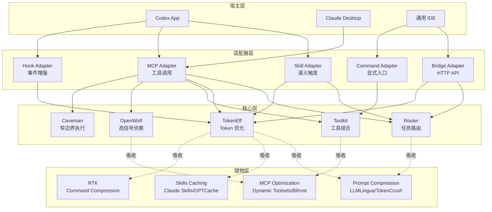

# TokenFlow

**TokenFlow** 是一个面向智能体的 token 感知工具控制层，用于统一管理可持续吸收的猎物能力源，并按宿主最佳接入形式生成 `Skill`、`MCP`、`Hook`、`Command` 等适配器。

## 核心特性

- **宿主无关**：核心能力独立于任何 IDE 或智能体平台
- **多适配器支持**：根据宿主能力自动选择最佳接入方式（Skill、MCP、Hook、Command）
- **可扩展猎物生态**：持续吸收新的 token 优化能力源（Prompt Compression、MCP Optimization、Skills Caching、RTK 等）
- **统一能力真源**：所有适配器从同一套能力定义生成，保证一致性
- **生产前闭环可验证**：提供生成、验证、TypeScript 构建、adapter scaffold、core execution seam 和 smoke test 闭环；候选家族算法仍按吸收门槛逐步实装

> 当前运行边界：本仓库已经具备机器真源、生成器、校验器、TypeScript 构建链、adapter scaffold、core execution seam、真实 MCP SDK stdio server 和 smoke test 闭环；`adapters/mcp/sdk-server.ts` 通过 `@modelcontextprotocol/sdk` 暴露 5 个 TokenFlow tools，并接入 `core/executor.ts`。候选家族（LLMLingua、RTK、GPTCache 等）的外部算法尚未提升为 `absorbed`。`sdk-server.js` / `gateway.js` / `bridge.js` 位于 `dist/` 构建产物中，先运行 `npm install` 与 `npm run build`。

## 快速开始

### 1. 生成适配器产物

```powershell
# 克隆或进入项目目录
cd E:\AI\Skills-mcp-chajian\token-workflow-tools

# 为 Codex App 生成适配器
.\scripts\Invoke-TokenFlowGeneration.ps1 -HostCapability "codex-app"

# 验证生成结果
.\scripts\Invoke-TokenFlowValidation.ps1

# 类型检查、构建和 runtime seam 验证
npm install
npm run verify
```

完整接入说明见 [安装与宿主接入指南](docs/install-guide.md)。

### 2. 集成到宿主

根据宿主类型选择集成方式：

#### Codex App

```powershell
# 复制 Skill 到 Codex skills 目录
Copy-Item -Path "examples\generated\skill\*" -Destination "D:\AI\CodexHome\skills\" -Recurse -Force

# 配置 MCP Server
# 编辑 D:\AI\CodexHome\.codex\mcp_settings.json，添加 TokenFlow MCP 服务
```

#### MCP 原生客户端（Claude Desktop、Cline）

```json
// claude_desktop_config.json 或 .cline/mcp_settings.json
{
  "mcpServers": {
    "tokenflow": {
      "command": "node",
      "args": [
        "E:/AI/Skills-mcp-chajian/token-workflow-tools/dist/adapters/mcp/sdk-server.js",
        "--projection",
        "E:/AI/Skills-mcp-chajian/token-workflow-tools/examples/generated/mcp/tool-schema-projection.json"
      ]
    }
  }
}
```

#### 通用 IDE（通过 HTTP Bridge）

```powershell
# 目标构建产物示例：启动 Generic Bridge
node dist/adapters/generic-ide/bridge.js --host-id my-ide --mcp-projection examples/generated/mcp/tool-schema-projection.json --port 3100

# 通过 HTTP API 调用
curl -X POST http://localhost:3100/invoke -H "Content-Type: application/json" -d '{"tool_id":"tokenflow-router","input":{"task":"code review","hostCapabilities":["mcp"]}}'
```

### 3. 验证集成

在宿主中测试 TokenFlow 能力：

- **Skill 触发**：输入 "帮我压缩这个 prompt"（应触发 `tokenflow-prompt-compression`）
- **MCP 工具调用**：调用 `tokenflow-router` 工具获取路由决策
- **Hook 触发**：发送长 prompt，观察自动压缩

## 架构概览



## 核心能力

| 工具 | 职责 | 主要输入 | 主要输出 |
|------|------|---------|---------|
| **Router** | 任务路由、角色路由、模型路由、工具路由 | task, hostCapabilities | recommendedRole, recommendedModel, recommendedTools |
| **TokenEff** | Token 预算、上下文压缩、重路由建议 | contextWindow, currentUsage | compressionRatio, rerouteRecommendation |
| **Toolkit** | 为单任务组合最小工具包 | task, availableTools | minimalToolset, reasoning |
| **OpenWolf** | 高信号侦察、选择性摄入、提案前摸底 | targetScope, signalThreshold | highSignalFindings, recommendations |
| **Caveman** | 低上下文窄边界执行、验证、修复 | task, constraints | executionResult, verification |

## 候选猎物家族

TokenFlow 持续吸收新的 token 优化能力源：

| 家族 | 代表猎物 | 主要价值 | 当前状态 |
|------|---------|---------|---------|
| **Prompt Compression** | LLMLingua, prompt_compressor, TokenCrush | 直接压缩 Prompt，降低上下文成本 | candidate，已映射到 TokenEff |
| **MCP Optimization** | Dynamic Toolsets, Bifrost Gateway | 缩小工具表面、减少 schema 开销 | candidate，已映射到 Toolkit |
| **Skills Caching** | Claude Skills, Prompt Caching, GPTCache | 复用 SOP、前缀缓存、语义复用 | candidate，已映射到 Skill Adapter |
| **RTK** | rtk-ai/rtk | 命令输出压缩、上下文裁剪 | candidate，已映射到 Hook/Command |

## 宿主支持矩阵

| 宿主 | Skill | MCP | Hook | Command | Bridge | 推荐配置 |
|------|-------|-----|------|---------|--------|---------|
| **Codex App** | ✅ | ✅ | ✅ | ✅ | - | Skill + MCP + Hook |
| **Claude Desktop** | - | ✅ | - | - | - | MCP Server |
| **Cline** | - | ✅ | - | - | - | MCP Server |
| **Cursor** | - | ✅ | - | ✅ | ✅ | MCP Gateway + Command |
| **Windsurf** | - | ✅ | - | ✅ | ✅ | MCP Gateway + Command |
| **通用 IDE** | - | - | - | ✅ | ✅ | Bridge + Command |

## 项目结构

```text
token-workflow-tools/
├── core/                           # 核心能力层
│   ├── capability-graph.json       # 能力图谱
│   ├── router/                     # Router 模块
│   ├── tokeneff/                   # TokenEff 模块
│   ├── toolkit/                    # Toolkit 模块
│   ├── openwolf/                   # OpenWolf 模块
│   └── caveman/                    # Caveman 模块
├── adapters/                       # 适配器层
│   ├── skill/                      # Skill 适配器
│   ├── mcp/                        # MCP 适配器（Server + Gateway）
│   ├── hook/                       # Hook 适配器
│   ├── command/                    # Command 适配器
│   ├── generic-ide/                # 通用 IDE Bridge
│   └── codex-teams/                # Codex Teams Bridge
├── prey/                           # 猎物层
│   ├── sources/                    # 已确认猎物源
│   ├── candidates/                 # 候选猎物池
│   ├── prey-sources.json           # 猎物注册表
│   ├── source-capability-matrix.md # 能力映射矩阵
│   └── absorption-status.md        # 吸收状态
├── manifests/                      # 能力清单
│   ├── tooling-manifest.json       # 工具元数据
│   ├── adapter-matrix.json         # 宿主适配矩阵
│   ├── candidate-families.json     # 候选家族定义
│   ├── family-rendering.json       # 家族渲染文案与 hook/command 配置真源
│   └── rendering-conventions.json  # 渲染约定
├── templates/                      # 适配器模板
│   ├── skill/                      # Skill 模板
│   ├── mcp/                        # MCP 模板
│   ├── hook/                       # Hook 模板
│   └── command/                    # Command 模板
├── scripts/                        # 生成和验证脚本
│   ├── Invoke-TokenFlowGeneration.ps1
│   └── Invoke-TokenFlowValidation.ps1
├── examples/                       # 示例和生成产物
│   └── generated/                  # 生成的适配器产物
│       ├── mcp/                    # MCP tool schemas
│       ├── skill/                  # Skill 骨架
│       ├── hook/                   # Hook 声明
│       └── command/                # Command 声明
└── docs/                           # 文档
    ├── generation-guide.md         # 生成指南
    ├── integration-guide.md        # 集成指南
    ├── runtime-guide.md            # 运行时指南
    └── README.md                   # 文档索引
```

## 使用示例

### 示例 1：路由决策

```javascript
// 调用 Router 获取任务路由建议
{
  "tool": "tokenflow-router",
  "input": {
    "task": "code review for large PR",
    "hostCapabilities": ["mcp", "skill", "hook"]
  }
}

// 返回
{
  "recommendedRole": "reviewer",
  "recommendedModel": "claude-opus-4",
  "recommendedTools": ["tokenflow-openwolf", "tokenflow-caveman"],
  "reasoning": "Large PR requires high-signal reconnaissance (OpenWolf) followed by focused execution (Caveman)"
}
```

### 示例 2：Token 预算优化

```javascript
// 调用 TokenEff 获取压缩建议
{
  "tool": "tokenflow-tokeneff",
  "input": {
    "contextWindow": 200000,
    "currentUsage": 180000
  }
}

// 返回
{
  "compressionRatio": 0.6,
  "rerouteRecommendation": "compress_context",
  "estimatedSavings": 72000,
  "reasoning": "Context usage at 90%, recommend compression to 60% of current size"
}
```

### 示例 3：工具表面优化

```javascript
// 调用 Toolkit 获取最小工具集
{
  "tool": "tokenflow-toolkit",
  "input": {
    "task": "fix TypeScript type error",
    "availableTools": ["read_file", "write_file", "run_command", "search_files", "list_directory", "git_diff", "git_commit"]
  }
}

// 返回
{
  "minimalToolset": ["read_file", "write_file", "run_command"],
  "reasoning": "Type error fix only needs file read/write and type check command",
  "excludedTools": ["search_files", "list_directory", "git_diff", "git_commit"],
  "estimatedTokenSavings": 1200
}
```

### 示例 4：高信号侦察

```javascript
// 调用 OpenWolf 进行代码库侦察
{
  "tool": "tokenflow-openwolf",
  "input": {
    "targetScope": "src/auth/",
    "signalThreshold": 0.7
  }
}

// 返回
{
  "highSignalFindings": [
    {
      "file": "src/auth/jwt.ts",
      "signal": 0.9,
      "reason": "Contains JWT validation logic with potential security issue"
    },
    {
      "file": "src/auth/session.ts",
      "signal": 0.8,
      "reason": "Session management with complex state transitions"
    }
  ],
  "recommendations": [
    "Focus on jwt.ts first - highest signal and security-critical",
    "Review session.ts for state machine correctness"
  ]
}
```

### 示例 5：窄边界执行

```javascript
// 调用 Caveman 进行聚焦修复
{
  "tool": "tokenflow-caveman",
  "input": {
    "task": "fix null pointer in getUserById",
    "constraints": {
      "maxFiles": 2,
      "maxLines": 50,
      "verificationRequired": true
    }
  }
}

// 返回
{
  "executionResult": {
    "filesModified": ["src/user/service.ts"],
    "linesChanged": 3,
    "changes": [
      {
        "file": "src/user/service.ts",
        "line": 42,
        "before": "return user.profile.name;",
        "after": "return user?.profile?.name ?? 'Unknown';"
      }
    ]
  },
  "verification": {
    "passed": true,
    "tests": ["user.service.test.ts::getUserById handles null user"]
  }
}
```

## 文档

- [生成指南](docs/generation-guide.md)：如何使用生成器从能力真源生成适配器产物
- [集成指南](docs/integration-guide.md)：如何将生成的产物接入不同宿主环境
- [运行时指南](docs/runtime-guide.md)：如何启动和配置 MCP Server、Gateway、Bridge
- [文档索引](docs/README.md)：完整文档导航

## 项目文档

- [项目索引](PROJECT_INDEX.md)：阅读顺序和关键文档
- [项目需求](PROJECT_REQUIREMENTS.md)：目标、范围、成功标准
- [项目架构](PROJECT_DETAILS.md)：目录结构、模块职责、适配器规划
- [项目约束](PROJECT_CONSTRAINTS.md)：设计原则和边界
- [项目状态](PROJECT_STATUS.md)：当前进展和下一步
- [猎物层说明](prey/README.md)：猎物源管理和吸收流程

## 开发

### 生成适配器

```powershell
# 生成所有适配器
.\scripts\Invoke-TokenFlowGeneration.ps1

# 为特定宿主生成
.\scripts\Invoke-TokenFlowGeneration.ps1 -HostCapability "codex-app"

# 清理后重新生成
.\scripts\Invoke-TokenFlowGeneration.ps1 -Clean
```

### 验证生成结果

```powershell
# 验证 JSON 真源和生成产物
.\scripts\Invoke-TokenFlowValidation.ps1

# 跳过生成产物验证（仅验证真源）
.\scripts\Invoke-TokenFlowValidation.ps1 -SkipGenerated
```

### 添加新的候选家族

1. 在 `manifests/candidate-families.json` 中添加家族定义
2. 在 `prey/candidates/` 中添加候选猎物文档
3. 在 `manifests/family-rendering.json` 中添加该家族的 Skill 文案、Hook 配置和 Command 配置
4. 重新生成并验证

### 扩展核心能力

1. 在 `core/capability-graph.json` 中添加模块定义
2. 在 `core/{module}/` 中实现模块逻辑
3. 在 `prey/prey-sources.json` 中注册猎物源
4. 更新 `prey/source-capability-matrix.md` 和 `prey/absorption-status.md`
5. 重新生成适配器

## 贡献

TokenFlow 欢迎贡献新的猎物能力源和适配器支持。

### 贡献流程

1. **识别候选猎物**：发现有价值的 token 优化工具或技术
2. **按家族归类**：判断属于哪个能力家族（或创建新家族）
3. **抽取能力精华**：提炼核心能力和接入方式
4. **判定吸收可行性**：评估是否能稳定落到 core 层
5. **提交 PR**：更新 `prey/candidates/`、`manifests/`、`core/`

### 贡献指南

- 新猎物必须先进入 `prey/candidates/` 候选池
- 能力抽取必须明确用途、触发条件、边界
- 吸收到 core 必须有明确的模块归属和接口定义
- 所有变更必须通过 `Invoke-TokenFlowValidation.ps1` 验证

## 许可证

本项目采用 MIT 许可证。详见 [LICENSE](LICENSE) 文件。

## 联系方式

- 项目仓库：`E:\AI\Skills-mcp-chajian\token-workflow-tools`
- 问题反馈：通过项目 Issue 跟踪器
- 文档问题：参考 [docs/README.md](docs/README.md)

---

**TokenFlow** - 让 token 感知成为智能体的核心能力
