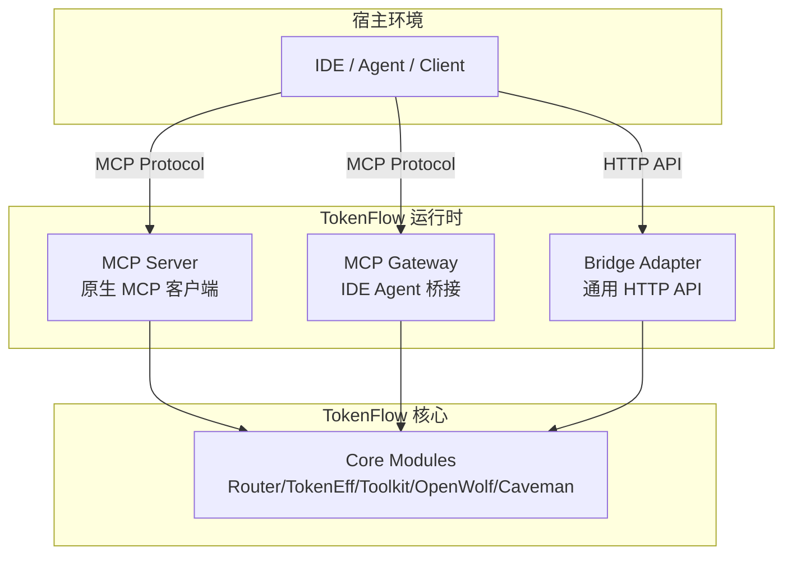

# 运行时指南

本文档说明如何启动和配置 TokenFlow 的运行时服务，包括 MCP Server、MCP Gateway 和 Bridge 适配器。

> 当前运行边界：本指南描述的是构建后的运行入口。当前仓库已提交 TypeScript 构建链，`adapters/mcp/sdk-server.ts` 通过 `@modelcontextprotocol/sdk` 暴露真实 stdio MCP server，并调用 `core/executor.ts` 的 host-agnostic execution seam；候选家族外部算法仍保持 `candidate`，尚未作为 absorbed 能力接入真实第三方压缩器或缓存服务。

构建与验证：

```powershell
npm install
npm run verify
```

## 运行时架构

TokenFlow 提供三种运行时入口：



### 运行时选择

| 运行时 | 适用场景 | 协议 | 宿主要求 |
|--------|---------|------|---------|
| **MCP Server** | MCP 原生客户端（Claude Desktop、Cline） | MCP stdio | 支持 MCP 协议 |
| **MCP Gateway** | IDE Agent（Codex App、Cursor） | MCP stdio | 支持 MCP 协议 |
| **Generic Bridge** | 通用 IDE 无 MCP 支持 | HTTP REST | 支持 HTTP 调用 |
| **Codex Teams Bridge** | Codex Teams 多代理协作 | HTTP REST | Codex Teams 环境 |

---

## MCP Server 运行时

### 适用场景

- MCP 原生客户端（Claude Desktop、Cline）
- 需要真实 MCP stdio 协议工具表面
- 工具调用频繁，需要低延迟

### 启动方式

#### 方式 1：直接启动（开发调试）

```powershell
# 进入项目根目录
cd E:\AI\Skills-mcp-chajian\token-workflow-tools

# 启动构建后的 MCP SDK stdio Server 入口
node dist/adapters/mcp/sdk-server.js
```

#### 方式 2：通过宿主配置启动（构建后使用）

**Claude Desktop 配置** (`%APPDATA%\Claude\claude_desktop_config.json`)：

```json
{
  "mcpServers": {
    "tokenflow": {
      "command": "node",
      "args": [
        "E:/AI/Skills-mcp-chajian/token-workflow-tools/dist/adapters/mcp/sdk-server.js"
      ],
      "env": {
        "TOKENFLOW_LOG_LEVEL": "info",
        "TOKENFLOW_CORE_PATH": "E:/AI/Skills-mcp-chajian/token-workflow-tools/core"
      }
    }
  }
}
```

**Cline 配置** (`.cline/mcp_settings.json`)：

```json
{
  "mcpServers": {
    "tokenflow": {
      "command": "node",
      "args": [
        "E:/AI/Skills-mcp-chajian/token-workflow-tools/dist/adapters/mcp/sdk-server.js"
      ]
    }
  }
}
```

### 配置选项

| 参数 | 类型 | 默认值 | 说明 |
|------|------|--------|------|
| `--projection` | string | 必需 | tool-schema-projection.json 路径 |
| `--core-path` | string | `./core` | core 模块根目录 |
| `--log-level` | string | `info` | 日志级别：debug/info/warn/error |
| `--max-concurrent` | number | `10` | 最大并发工具调用数 |

### 环境变量

| 变量 | 说明 | 示例 |
|------|------|------|
| `TOKENFLOW_LOG_LEVEL` | 日志级别 | `debug` |
| `TOKENFLOW_CORE_PATH` | core 模块路径 | `E:/AI/.../core` |
| `TOKENFLOW_CACHE_DIR` | 缓存目录 | `E:/AI/.../cache` |
| `TOKENFLOW_MAX_CONTEXT` | 最大上下文窗口 | `200000` |

### 验证运行

```powershell
# 检查目标构建产物进程
Get-Process | Where-Object { $_.ProcessName -like "*node*" -and $_.CommandLine -like "*sdk-server.js*" }

# 查看日志（如果配置了日志文件）
Get-Content -Path "logs/tokenflow-server.log" -Tail 20 -Wait
```

---

## MCP Gateway 运行时

### 适用场景

- IDE Agent（Codex App、Cursor、Windsurf）
- 需要在 MCP 协议和宿主之间做桥接
- 需要上下文转换和状态管理

### 启动方式

#### 方式 1：直接启动（开发调试）

```powershell
node dist/adapters/mcp/gateway.js --projection examples/generated/mcp/tool-schema-projection.json --host-id codex-app
```

#### 方式 2：通过宿主配置启动（构建后使用）

**Codex App 配置** (`D:\AI\CodexHome\.codex\mcp_settings.json`)：

```json
{
  "mcpServers": {
    "tokenflow": {
      "command": "node",
      "args": [
        "E:/AI/Skills-mcp-chajian/token-workflow-tools/dist/adapters/mcp/gateway.js",
        "--projection",
        "E:/AI/Skills-mcp-chajian/token-workflow-tools/examples/generated/mcp/tool-schema-projection.json",
        "--host-id",
        "codex-app"
      ],
      "env": {
        "TOKENFLOW_GATEWAY_MODE": "bridge",
        "TOKENFLOW_CONTEXT_SYNC": "true"
      }
    }
  }
}
```

### 配置选项

| 参数 | 类型 | 默认值 | 说明 |
|------|------|--------|------|
| `--projection` | string | 必需 | tool-schema-projection.json 路径 |
| `--host-id` | string | `ide-agent` | 宿主能力标识 |
| `--core-path` | string | `./core` | core 模块根目录 |
| `--log-level` | string | `info` | 日志级别 |
| `--context-sync` | boolean | `true` | 是否同步宿主上下文 |
| `--state-file` | string | - | 状态持久化文件路径 |

### 环境变量

| 变量 | 说明 | 示例 |
|------|------|------|
| `TOKENFLOW_GATEWAY_MODE` | Gateway 模式：bridge/proxy | `bridge` |
| `TOKENFLOW_CONTEXT_SYNC` | 是否同步上下文 | `true` |
| `TOKENFLOW_STATE_FILE` | 状态文件路径 | `E:/AI/.../state.json` |

### Gateway 模式

#### Bridge 模式（推荐）

- 在宿主和 core 之间建立完整桥接
- 处理上下文转换、状态同步、错误恢复
- 适合需要深度集成的场景

```powershell
node dist/adapters/mcp/gateway.js --projection examples/generated/mcp/tool-schema-projection.json --host-id codex-app
```

#### Proxy 模式

- 轻量级代理，仅转发工具调用
- 不做上下文转换和状态管理
- 适合简单集成场景

```powershell
node dist/adapters/mcp/gateway.js --projection examples/generated/mcp/tool-schema-projection.json --host-id codex-app
# 设置环境变量
$env:TOKENFLOW_GATEWAY_MODE = "proxy"
```

---

## Generic Bridge 运行时

### 适用场景

- 通用 IDE 不支持 MCP 协议
- 需要通过 HTTP REST API 调用 TokenFlow
- 需要跨语言、跨平台集成

### 启动方式

```powershell
node dist/adapters/generic-ide/bridge.js --host-id my-ide --mcp-projection examples/generated/mcp/tool-schema-projection.json --port 3100
```

### 配置选项

| 参数 | 类型 | 默认值 | 说明 |
|------|------|--------|------|
| `--host-id` | string | 必需 | 宿主标识 |
| `--mcp-projection` | string | 必需 | tool-schema-projection.json 路径 |
| `--port` | number | `3100` | HTTP 服务端口 |
| `--host` | string | `localhost` | 绑定地址 |
| `--cors` | boolean | `false` | 是否启用 CORS |
| `--auth-token` | string | - | API 认证 token |

### API 端点

#### 1. 列出所有工具

```bash
GET http://localhost:3100/tools
```

**响应**：

```json
{
  "tools": [
    {
      "tool_id": "tokenflow-router",
      "title_zh": "Router",
      "capabilities": ["router"]
    },
    ...
  ]
}
```

#### 2. 调用工具

```bash
POST http://localhost:3100/invoke
Content-Type: application/json

{
  "tool_id": "tokenflow-router",
  "input": {
    "task": "code review",
    "hostCapabilities": ["mcp", "skill"]
  }
}
```

**响应**：

```json
{
  "success": true,
  "result": {
    "recommendedRole": "reviewer",
    "recommendedModel": "claude-opus-4",
    "recommendedTools": ["tokenflow-openwolf", "tokenflow-caveman"]
  }
}
```

#### 3. 健康检查

```bash
GET http://localhost:3100/health
```

**响应**：

```json
{
  "status": "healthy",
  "uptime": 12345,
  "toolCount": 5
}
```

### 客户端示例

#### PowerShell

```powershell
$response = Invoke-RestMethod -Uri "http://localhost:3100/invoke" -Method Post -ContentType "application/json" -Body (@{
    tool_id = "tokenflow-router"
    input = @{
        task = "code review"
        hostCapabilities = @("mcp", "skill")
    }
} | ConvertTo-Json)

Write-Output $response
```

#### Python

```python
import requests

response = requests.post("http://localhost:3100/invoke", json={
    "tool_id": "tokenflow-router",
    "input": {
        "task": "code review",
        "hostCapabilities": ["mcp", "skill"]
    }
})

print(response.json())
```

#### JavaScript

```javascript
const response = await fetch("http://localhost:3100/invoke", {
  method: "POST",
  headers: { "Content-Type": "application/json" },
  body: JSON.stringify({
    tool_id: "tokenflow-router",
    input: {
      task: "code review",
      hostCapabilities: ["mcp", "skill"]
    }
  })
});

const result = await response.json();
console.log(result);
```

---

## Codex Teams Bridge 运行时

### 适用场景

- Codex Teams 多代理协作
- 需要访问 Teams 特性状态和上下文
- 需要与其他 Teams 代理协同

### 启动方式

```powershell
node dist/adapters/codex-teams/bridge.js --feature-state .codex-teams/features/tokenflow/status.md --mcp-projection examples/generated/mcp/tool-schema-projection.json
```

### 配置选项

| 参数 | 类型 | 默认值 | 说明 |
|------|------|--------|------|
| `--feature-state` | string | 必需 | Teams 特性状态文件路径 |
| `--mcp-projection` | string | 必需 | tool-schema-projection.json 路径 |
| `--port` | number | `3101` | HTTP 服务端口 |
| `--teams-context` | string | - | Teams 上下文目录 |

### Teams 集成

#### 1. 在 Teams Agent 中引用 TokenFlow

在 `.codex-teams/features/tokenflow/agents/worker-optimizer.md` 中：

```yaml
---
role: optimizer
capabilities:
  - tokenflow-tokeneff
  - tokenflow-toolkit
bridge_url: http://localhost:3101
---

# Optimizer Agent

使用 TokenFlow 优化上下文和工具表面。
```

#### 2. 调用 TokenFlow 工具

```bash
POST http://localhost:3101/invoke
Content-Type: application/json

{
  "tool_id": "tokenflow-tokeneff",
  "input": {
    "contextWindow": 200000,
    "currentUsage": 150000
  },
  "teams_context": {
    "feature": "tokenflow",
    "agent": "optimizer",
    "task_id": "T5"
  }
}
```

#### 3. 同步 Teams 状态

Bridge 会自动读取 `--feature-state` 指定的状态文件，并在工具调用时注入 Teams 上下文。

---

## 运行时监控

### 日志配置

#### 启用文件日志

```powershell
# 设置日志目录
$env:TOKENFLOW_LOG_DIR = "E:\AI\Skills-mcp-chajian\token-workflow-tools\logs"

# 启动时指定日志级别
node dist/adapters/mcp/sdk-server.js
```

#### 日志格式

```
[2026-05-13T10:30:45.123Z] [INFO] [tokenflow-server] Server started on stdio
[2026-05-13T10:30:46.456Z] [DEBUG] [tokenflow-router] Received input: {"task":"code review","hostCapabilities":["mcp","skill"]}
[2026-05-13T10:30:46.789Z] [INFO] [tokenflow-router] Routing decision: {"recommendedRole":"reviewer","recommendedModel":"claude-opus-4"}
```

### 性能监控

#### 启用性能指标

```powershell
$env:TOKENFLOW_METRICS_ENABLED = "true"
$env:TOKENFLOW_METRICS_PORT = "9090"

node dist/adapters/mcp/sdk-server.js
```

#### 查询指标

```bash
# 工具调用次数
GET http://localhost:9090/metrics/tool_invocations

# 平均响应时间
GET http://localhost:9090/metrics/avg_response_time

# 错误率
GET http://localhost:9090/metrics/error_rate
```

### 健康检查

所有运行时都提供健康检查端点：

```bash
# MCP Server（通过 stdio，需要宿主支持）
# 发送 MCP ping 消息

# Gateway / Bridge（HTTP）
GET http://localhost:3100/health
```

---

## 故障排查

### 运行时无法启动

**症状**：进程启动后立即退出。

**可能原因**：

1. `--projection` 路径错误
2. Node.js 版本不兼容
3. 端口被占用（Gateway/Bridge）

**解决方法**：

```powershell
# 检查 projection 文件是否存在
Test-Path "examples/generated/mcp/tool-schema-projection.json"

# 检查 Node.js 版本（需要 >= 18）
node --version

# 检查端口占用（Gateway/Bridge）
Get-NetTCPConnection -LocalPort 3100 -ErrorAction SilentlyContinue
```

### 工具调用失败

**症状**：工具调用返回错误或超时。

**可能原因**：

1. core 模块路径错误
2. 输入参数不符合 schema
3. core 模块执行异常

**解决方法**：

```powershell
# 启用 debug 日志
$env:TOKENFLOW_LOG_LEVEL = "debug"
node dist/adapters/mcp/sdk-server.js

# 检查 core 模块路径
Test-Path "core/capability-graph.json"

# 验证 projection schema
.\scripts\Invoke-TokenFlowValidation.ps1
```

### 上下文同步失败

**症状**：Gateway 无法同步宿主上下文。

**可能原因**：

1. `--context-sync` 未启用
2. 宿主未提供上下文接口
3. 状态文件权限问题

**解决方法**：

```powershell
# 启用上下文同步
$env:TOKENFLOW_CONTEXT_SYNC = "true"

# 检查状态文件权限
$stateFile = "E:\AI\Skills-mcp-chajian\token-workflow-tools\state.json"
if (Test-Path $stateFile) {
    Get-Acl $stateFile | Format-List
}
```

### Bridge API 无响应

**症状**：HTTP 请求超时或无响应。

**可能原因**：

1. Bridge 未启动
2. 端口配置错误
3. 防火墙阻止

**解决方法**：

```powershell
# 检查 Bridge 进程
Get-Process | Where-Object { $_.ProcessName -like "*node*" -and $_.CommandLine -like "*bridge.js*" }

# 测试端口连通性
Test-NetConnection -ComputerName localhost -Port 3100

# 临时禁用防火墙测试（仅调试用）
# Set-NetFirewallProfile -Profile Domain,Public,Private -Enabled False
```

---

## 生产部署建议

### 1. 使用进程管理器

**PM2（推荐）**：

```bash
# 安装 PM2
npm install -g pm2

# 启动 MCP Server
pm2 start dist/adapters/mcp/sdk-server.js --name tokenflow-server

# 启动 Gateway
pm2 start dist/adapters/mcp/gateway.js --name tokenflow-gateway -- --projection examples/generated/mcp/tool-schema-projection.json --host-id codex-app

# 查看状态
pm2 status

# 查看日志
pm2 logs tokenflow-server

# 开机自启
pm2 startup
pm2 save
```

### 2. 配置日志轮转

```javascript
// pm2.config.js
module.exports = {
  apps: [{
    name: "tokenflow-server",
    script: "dist/adapters/mcp/sdk-server.js",
    args: "--projection examples/generated/mcp/tool-schema-projection.json",
    error_file: "logs/tokenflow-server-error.log",
    out_file: "logs/tokenflow-server-out.log",
    log_date_format: "YYYY-MM-DD HH:mm:ss Z",
    max_memory_restart: "500M"
  }]
};
```

### 3. 启用认证（Bridge）

```powershell
# 生成认证 token
$token = [System.Convert]::ToBase64String([System.Text.Encoding]::UTF8.GetBytes((New-Guid).ToString()))

# 启动 Bridge 时指定 token
node dist/adapters/generic-ide/bridge.js --host-id my-ide --mcp-projection examples/generated/mcp/tool-schema-projection.json --auth-token $token
```

客户端调用时携带 token：

```bash
curl -X POST http://localhost:3100/invoke \
  -H "Authorization: Bearer YOUR_TOKEN_HERE" \
  -H "Content-Type: application/json" \
  -d '{"tool_id":"tokenflow-router","input":{"task":"code review"}}'
```

### 4. 配置反向代理（可选）

使用 Nginx 或 Caddy 为 Bridge 提供 HTTPS 和负载均衡：

```nginx
# nginx.conf
upstream tokenflow_bridge {
    server localhost:3100;
}

server {
    listen 443 ssl;
    server_name tokenflow.example.com;

    ssl_certificate /path/to/cert.pem;
    ssl_certificate_key /path/to/key.pem;

    location / {
        proxy_pass http://tokenflow_bridge;
        proxy_set_header Host $host;
        proxy_set_header X-Real-IP $remote_addr;
    }
}
```

---

## 下一步

- [集成指南](integration-guide.md)：了解如何将运行时集成到不同宿主
- [生成指南](generation-guide.md)：了解如何生成适配器产物
- [项目架构](../PROJECT_DETAILS.md)：深入了解架构设计
